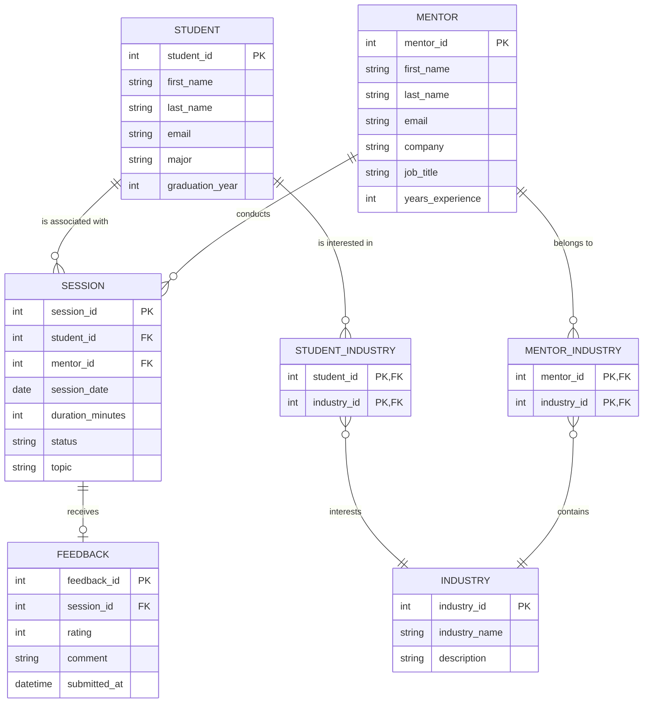
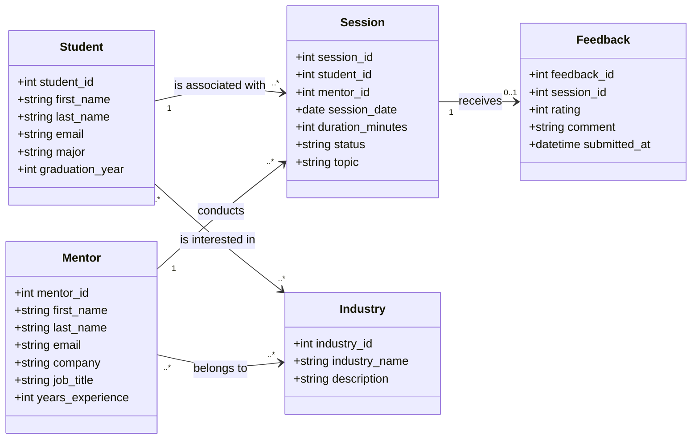

# MentorBridge: a simple system to connect students with alumni mentors and keep mentorship organized
**Members:** Abhinav Nadupalli and Keegan Carey

**Short Description:**
MentorBridge is a database system that helps students connect with alumni mentors in a more organized and reliable way. Right now, mentorship often happens through scattered emails or LinkedIn messages, which makes it hard to track conversations and follow ups. Our system stores mentor profiles, student interests, session requests, and meeting history in one place. Students can search for mentors by industry or career path, and mentors can manage their availability and see their past sessions. This project addresses a real need for clearer, more transparent mentorship connections within a university community.

**User Personas:**

Students looking for career guidance
Alumni mentors who want to give back
University staff tracking mentorship engagement

**User Stories:**

* As a student, I want to search mentors by industry so I can find someone aligned with my goals.
* As a student, I want to request a meeting so I can receive advice and guidance.
* As a mentor, I want to set my availability so students can schedule times that work for me.
* As a mentor, I want to see my session history so I can keep track of who I have supported.
* As a staff member, I want to view overall mentorship activity so I can understand engagement levels.

# Crows Foot ERD diagram

# UML Diagram

