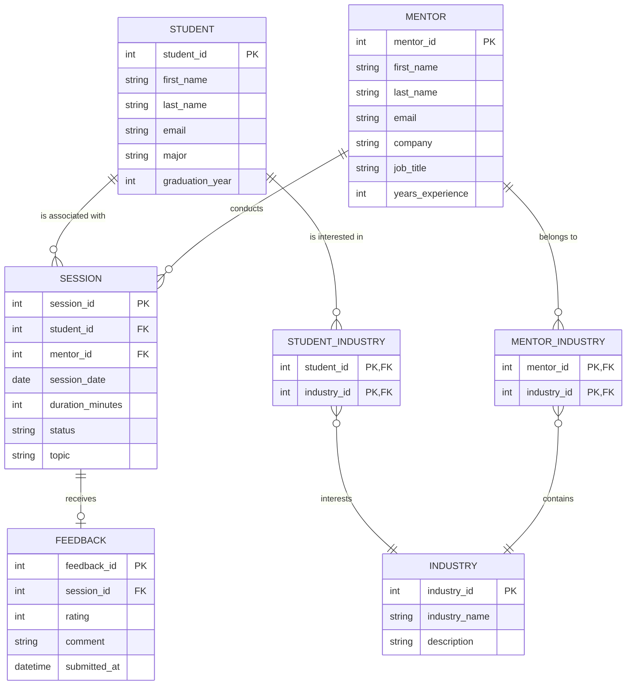
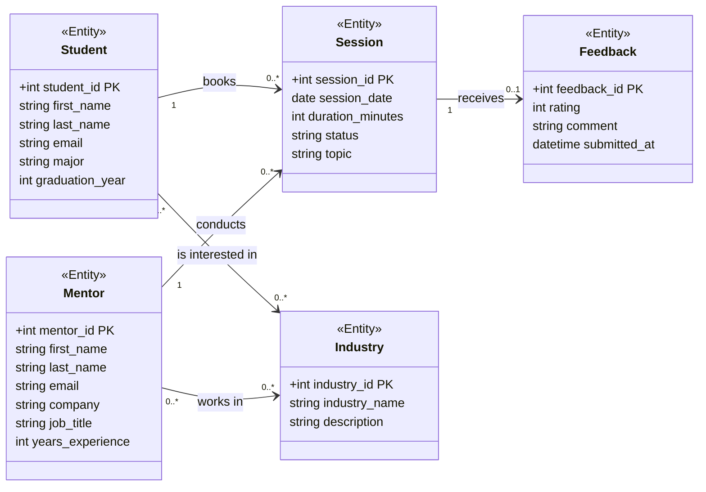
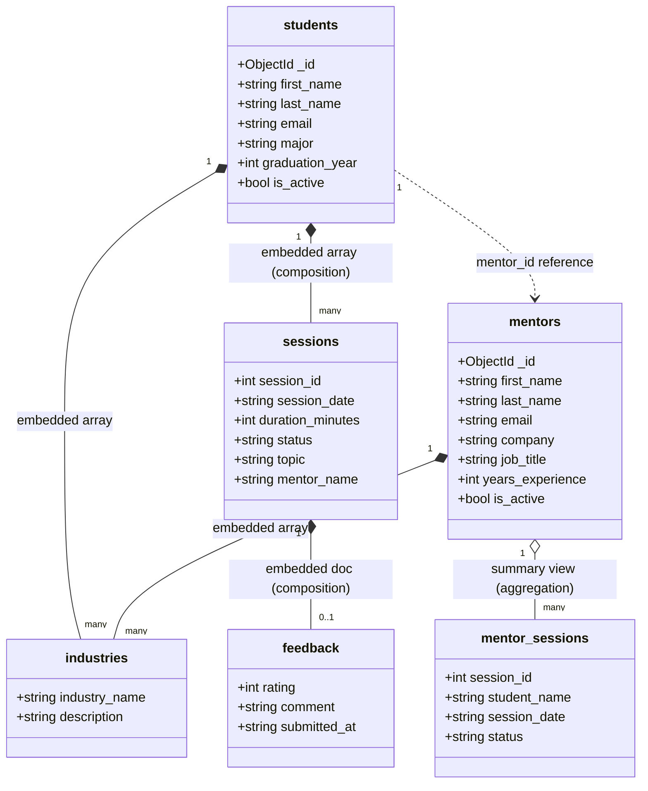

# MentorBridge: a simple system to connect students with alumni mentors and keep mentorship organized
**Members:** Abhinav Nadupalli and Keegan Carey

**Short Description:**
MentorBridge is a database system that helps students connect with alumni mentors in a more organized and reliable way. Right now, mentorship often happens through scattered emails or LinkedIn messages, which makes it hard to track conversations and follow ups. Our system stores mentor profiles, student interests, session requests, and meeting history in one place. Students can search for mentors by industry or career path, and mentors can manage their availability and see their past sessions. This project addresses a real need for clearer, more transparent mentorship connections within a university community.

**User Personas:**

Students looking for career guidance
Alumni mentors who want to give back
University staff tracking mentorship engagement

**User Stories:**

* As a student, I want to search mentors by industry so I can find someone aligned with my goals.
* As a student, I want to request a meeting so I can receive advice and guidance.
* As a mentor, I want to set my availability so students can schedule times that work for me.
* As a mentor, I want to see my session history so I can keep track of who I have supported.
* As a staff member, I want to view overall mentorship activity so I can understand engagement levels.


## Crows Foot ERD diagram


## UML Diagram


## Project 2 Hierarchical Diagram



# Node App Interfaces

Because we have no experience with HTML, we used Claude Haiku to assist in the generation of the styling of the web pages for the interface. We directed it as to what we wanted the UI to look like and it helped us create it.
Additionally, Gemini was used to assist in the generation of some parts of the js backend and figuring out how to use node as it was entirely new to us.

### SQLite App (Project 1)
```bash
cd app
npm install
npm start
```
The website should start on localhost:3000. This version uses SQLite and has CRUD for Students and Sessions.

### MongoDB App (Project 2)
Make sure MongoDB is running first (see setup instructions below), then:
```bash
cd app-mongo
npm install
npm start
```
The website should start on localhost:3001. This version uses MongoDB and has CRUD for Students and Mentors.

## MongoDB Queries

The file `queries/mongo_queries.js` contains 6 MongoDB queries that can be run using `mongosh` after setting up the database.

To run them, open `mongosh`, switch to `use mentorbridge`, and paste each query.

## How to set up the MongoDB database in Docker

We use MongoDB to store the mentorship data. There are two collections: students and mentors.
You can use a local install to run it similarly, but this shows how to start it using docker.

---

### 1. Start the MongoDB container

```bash
docker run -d --name my-mongodb -p 27017:27017 mongo:latest
```

If you already have the container, just start it:
```bash
docker start my-mongodb
```

*or just click the play button on Docker Desktop*

### 2. Import the data

Run these commands from the project root folder:

```bash
docker exec -i my-mongodb mongoimport --db mentorbridge --collection students --jsonArray < data/students.json
```

```bash
docker exec -i my-mongodb mongoimport --db mentorbridge --collection mentors --jsonArray < data/mentors.json
```

You should see "5 document(s) imported successfully" for students and "4 document(s) imported successfully" for mentors.

### 3. View the Data
```bash
docker exec -it my-mongodb mongosh mentorbridge
```
Then run:
```
db.students.find().pretty()
db.mentors.find().pretty()
```
*pretty() just formats it so its easy to look at*
### If you want to restore from the dump file instead

Copy the dump folder into the container and restore:
```bash
mongorestore --db mentorbridge ./dump/mentorbridge
```